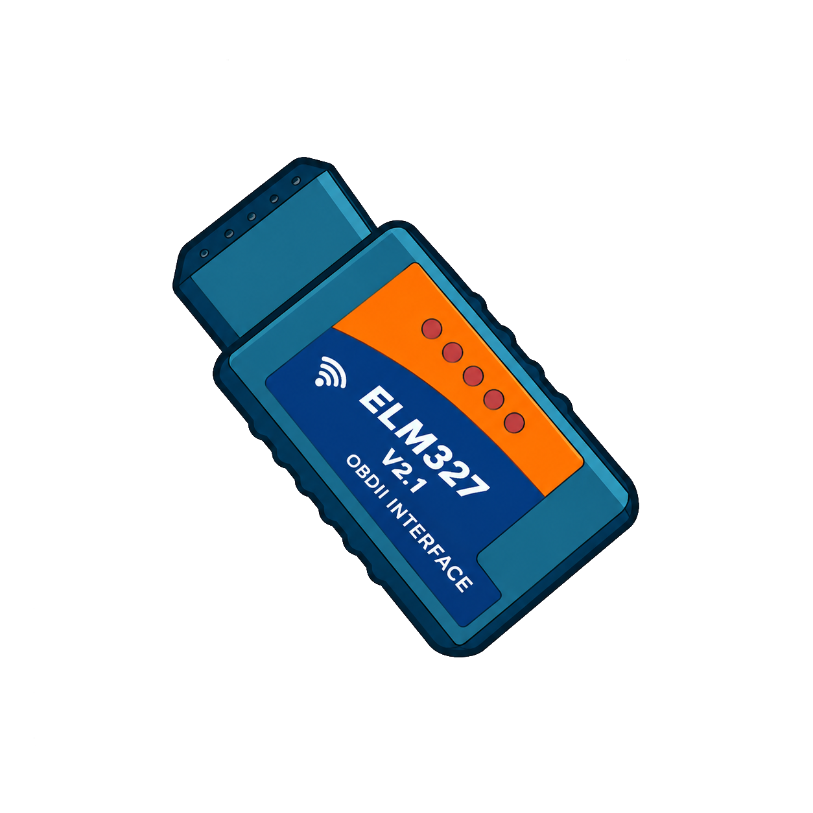

<h1 align="left">
  
  ELM327 Emulator Android
</h1>

-3DDC84?logo=android&logoColor=white)
-478CBF?logo=godot-engine&logoColor=white)  

Android app to simulate, emulate an ELM327 (Wifi, Bluetooth BLE, Bluetooth) connected to a car (0-n ECUs) for testing OBD-II, UDS applications.  
You can plug in or plug out ECUs of simulation, change default protocol, inspect logs, share your config with other devs.  
Turn your phone into a virtual car with ELM327 connected.  

<table>
  <tr>
    <td width="50%"></td>
    <td width="50%"></td>
  </tr>
  <tr>
    <td width="50%"></td>
    <td width="50%"></td>
  </tr>
  <tr>
    <td width="50%"></td>
  </tr>
</table>

## Use cases
Test your scantool software before going into production ? for example with [autodiag](https://github.com/autodiag2/autodiag/).  
Curious about how your scantool works ?    
Go more deeper with a playable virtual car linked to the virtual ELM327, Test fuel consumption, evaluate dyno test and much more !

## Download
Available with [releases](https://github.com/autodiag2/ELM327SimAndroid/releases/) or from [fdroid](https://f-droid.org/fr/packages/com.github.autodiag2.elm327emu/).
 

**Compatibility**: The application supports Android 5.1 (API 22) and newer. However, the embedded Godot engine requires Android 7.0 (API 24) or later, so Godot-based features are available only on devices running Android 7.0+. For older devices prefer `com.github.autodiag2.elm327emu-light.apk`, even with this BLE mode may not work on all devices (see log).

## Dev
See [this](/doc/DEV.md)

## Contributing
 - This app is open to contributions, also if you want to help the app to grow you can participate to internal tests for google play (send a mail at autodiag@netcourrier.com with your google account mail).

## Credits
 - [Godot-Advanced-Vehicle](https://github.com/Dechode/Godot-Advanced-Vehicle) for the car sim view
